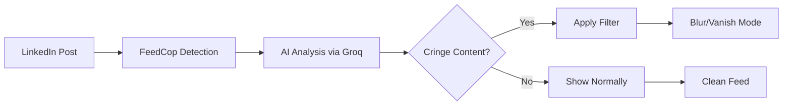

<div align="center">

# 🛡️ FeedCop

### AI-Powered LinkedIn Feed Filter

**Take control of your LinkedIn experience with intelligent content filtering**

[](https://addons.mozilla.org/en-US/firefox/addon/feed-cop/)
[](https://github.com/Abhishekhack2909/FeedCop)
[](LICENSE)


</div>

---

## 🎯 What is FeedCop?

FeedCop is an intelligent browser extension that transforms your LinkedIn experience by filtering out low-quality content using advanced AI. Say goodbye to cringe posts, clickbait, and engagement farming - and hello to a cleaner, more professional feed.

### ✨ Key Features

- 🤖 **AI-Powered Filtering** - Uses Groq's LLM to intelligently identify cringe content
- 🎛️ **Dual Filter Modes** - Choose between Blur or Vanish modes
- 🔇 **Mute Words** - Automatically filter posts containing specific keywords
- ⚡ **Real-time Processing** - Filters content as you scroll
- 🎨 **Beautiful UI** - Modern, vibrant interface with smooth animations
- 🔒 **Privacy First** - All processing happens locally, your data stays private

---

## 🚀 Quick Start

### 🦊 Firefox (Recommended)

**✅ Official Firefox Add-on Store**

1. **Install directly from Firefox Add-ons:**
   
   [](https://addons.mozilla.org/en-US/firefox/addon/feed-cop/)

2. **Set up your API key** (see [API Setup](#-api-setup) below)

3. **Start filtering!** 🎉

### 🌐 Chrome & Other Browsers

**📦 Manual Installation Required**

1. **Clone this repository:**
   ```bash
   git clone https://github.com/Abhishekhack2909/FeedCop.git
   cd FeedCop
   ```

2. **For Chrome:**
   - Rename `manifest-chrome.json` to `manifest.json`
   - Open Chrome → `chrome://extensions/`
   - Enable "Developer mode"
   - Click "Load unpacked" → Select the `FeedCop` folder

3. **For Edge:**
   - Same as Chrome but use `edge://extensions/`

4. **Set up your API key** (see [API Setup](#-api-setup) below)

---

## 🔑 API Setup

FeedCop requires a **free** Groq API key to power its AI filtering capabilities.

### Step 1: Get Your Free Groq API Key

1. **Visit Groq Console:** [https://console.groq.com](https://console.groq.com)
2. **Sign up/Login** with your preferred method
3. **Navigate to API Keys** section
4. **Create a new API key** and copy it

> 💡 **Groq offers generous free tier limits** - perfect for personal use!

### Step 2: Configure FeedCop

1. **Click the FeedCop icon** in your browser toolbar
2. **Click the settings gear** ⚙️ icon
3. **Paste your API key** in the input field
4. **Click "Save"** ✅

### Step 3: Start Filtering!

1. **Return to the main popup**
2. **Toggle "Extension Active"** to enable filtering
3. **Visit LinkedIn** and watch FeedCop work its magic! ✨

---

## 🎮 How to Use

### 🔄 Toggle Filtering
- Click the **FeedCop icon** in your toolbar
- Use the **large toggle switch** to enable/disable filtering
- Watch the status change from "Extension Disabled" to "Extension Active"

### 🎛️ Choose Your Filter Mode

**🌫️ Blur Mode** (Default)
- Blurs cringe content with a "Click to View" option
- Lets you decide if you want to see the content

**👻 Vanish Mode**
- Completely removes cringe content from your feed
- Creates a cleaner, distraction-free experience

### 🔇 Mute Words Feature

1. **Add keywords** you want to filter (e.g., "promoted", "engagement", "viral")
2. **Posts containing these words** will be automatically filtered
3. **Manage your list** - add/remove words anytime

### 📊 Track Your Progress

- **Cringe Dodged:** See how many low-quality posts you've avoided
- **Time Saved:** Estimate of time saved from not viewing cringe content

---

## 🧠 How It Works



### 🔍 AI Filtering Criteria

FeedCop's AI identifies posts that contain:

- 📢 **Engagement Bait** - "Like if you agree", "Comment interested"
- 🎪 **Clickbait Headlines** - Overly dramatic or misleading titles
- 💰 **Promotional Spam** - Excessive self-promotion or course selling
- 🎭 **Fake Inspiration** - Generic motivational content without substance
- 🤖 **AI-Generated Content** - Low-effort automated posts
- 📱 **Off-topic Content** - Non-professional personal posts

---

## 🛠️ Technical Details

### 🏗️ Architecture
- **Frontend:** Vanilla JavaScript with modern ES6+ features
- **AI Processing:** Groq API with Gemma2-9B-IT model
- **Storage:** Browser's sync storage for cross-device settings
- **Compatibility:** Manifest V2 (Firefox) & V3 (Chrome) support

### 🔒 Privacy & Security
- **Local Processing:** Content analysis happens via secure API calls
- **No Data Storage:** FeedCop doesn't store your LinkedIn data
- **API Key Security:** Keys are stored locally in browser storage
- **Open Source:** Full transparency - inspect the code yourself

---

## 🤝 Contributing

We welcome contributions! Here's how you can help:

### 🐛 Report Issues
- Found a bug? [Open an issue](https://github.com/Abhishekhack2909/FeedCop/issues)
- Include browser version, steps to reproduce, and screenshots

### 💡 Suggest Features
- Have an idea? [Start a discussion](https://github.com/Abhishekhack2909/FeedCop/discussions)
- Check existing issues first to avoid duplicates

### 🔧 Development Setup

1. **Fork & Clone:**
   ```bash
   git clone https://github.com/yourusername/FeedCop.git
   cd FeedCop
   ```

2. **Load in Browser:**
   - Follow the manual installation steps above
   - Make your changes and test locally

3. **Submit PR:**
   - Create a feature branch
   - Make your changes
   - Submit a pull request with clear description

---

## 📋 Roadmap

### ✅ Completed
- [x] AI-powered content filtering
- [x] Dual filter modes (Blur/Vanish)
- [x] Mute words functionality
- [x] Cross-browser compatibility
- [x] Modern UI with vibrant design
- [x] Firefox Add-on Store publication

### 🚧 In Progress
- [ ] Custom filter criteria configuration
- [ ] Advanced statistics and analytics
- [ ] Export/import settings

### 🔮 Future Plans
- [ ] Support for other social platforms (Twitter, Instagram)
- [ ] Machine learning model improvements
- [ ] Community-driven filter rules
- [ ] Mobile browser support

---

## 📊 Stats & Recognition

<div align="center">


</div>

---

## 🙏 Acknowledgments

- **Groq** for providing excellent AI API services
- **Mozilla** for the Firefox Add-on platform
- **LinkedIn** for the platform (even though we're filtering it! 😄)
- **Open Source Community** for inspiration and feedback

---

## 📞 Support & Contact

<div align="center">

**Built with ❤️ by [Abhishek Tripathi](https://www.linkedin.com/in/abhishek-tripathi-a714ab30b/)**

[](https://www.linkedin.com/in/abhishek-tripathi-a714ab30b/)
[](https://github.com/Abhishekhack2909)
[](mailto:your-email@example.com)

### 💬 Get Help
- 📖 [Documentation](https://github.com/Abhishekhack2909/FeedCop/wiki)
- 🐛 [Report Issues](https://github.com/Abhishekhack2909/FeedCop/issues)
- 💡 [Feature Requests](https://github.com/Abhishekhack2909/FeedCop/discussions)
- ⭐ **Like FeedCop? Give us a star!**

</div>

---

<div align="center">

**🛡️ Take back control of your LinkedIn feed with FeedCop! 🛡️**

*Made with passion for a cleaner, more professional LinkedIn experience*

</div>
